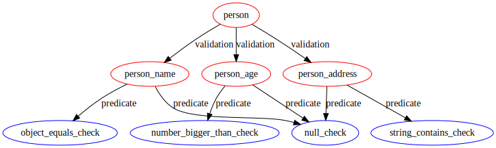

[](https://travis-ci.org/iintothewind/validation)

# com.github.iintothewind.Validation
A simple functional Validation framework

## Install

### bintray repository

[https://bintray.com/iintothewind/maven/validation](https://bintray.com/iintothewind/maven/validation)

### maven install

- add repository

```xml
<repositories>
  <repository>
    <id>validation-release</id>
    <url>https://dl.bintray.com/iintothewind/maven</url>
  </repository>
</repositories>
```

- add dependency

```xml
<dependencies>
  <dependency>
    <groupId>com.github.iintothewind</groupId>
    <artifactId>Validation</artifactId>
    <version>0.4</version>
    <type>pom</type>
  </dependency>
</dependencies>
```

### gradle install

- add repository

```groovy
repositories {
    maven {
        url "https://dl.bintray.com/iintothewind/maven"
    }
}
```

- add dependency

```groovy
dependencies {
    implementation "com.github.iintothewind:Validation:0.4"
}
```

## Purpose

Consider there is an object instance `person` as following: 

```java
public class Person {
  private String name;
  private int age;
  private String address;
}
```

And the validation checks:

- the `person.name` should be equal to `John`
- and `person.age` should be greater than `18`
- and `person.address` should contains `China`

If any of the above checks failed, that validation should fail.

Too many times, I saw developers who prefer Java 7 or older version language features 
wrote this kind of **shit** on production environment: 
```java
public void theLameValidation(final Person person) {
  if(person == null) {
    throw new ValidationException("person should not be null");
  }
  if(StringUtils.isEmpty(person.getName()) || !person.getName().equals("John")) {
    throw new ValidationException("person.name should not be empty");
  }
  if(person.getAge() == null || person.getAget() <= 18) {
    throw new ValidationException("person.age should be greater than 18");
  }
  if(person.getAddress() == null || !person.getAddress().contains("China")) {
    throw new ValidationException("person.address should contain China");
  }
}
```

It is obvious that the above validation is clumsy and not reusable:
- The validation breaks and exception throws when any check is failed. 
Consider this validation is used in a request, and client just submitted a request with a `Person` instance, with `name = Jack, Age = 12, Address = "US"`. 
The client users will have to try and fix at least 3 times to submit a correct request then they can finally pass the validation.
- Validation error is captured in exceptions. Developers who use this validation method has to use try-catch to get the validation result, which makes code very ugly.
- The validation logic could vary in different scenarios. This method will not be useful for a different scenario


To resolve the above problems, the design purposes of this simple validation framework are:

- Return comprehensive failure messages when validation fails, not part of them
- Validations should be reusable
- Validations should be composable
- Zero external dependencies. All code is implemented by using jdk internal APIs.

## Differences from Java Bean Validation (JSR303, JSR380)

- `JSR303`,`JSR380` focus on **java bean** , it does not work on other arbitrary objects.
- The validations on each bean member variables cannot breakdown and cannot be composed from each other. 
`JSR303`,`JSR380` validate full bean member variables. It requires each validation for every member variable should pass, then whole validation can pass.
But the validation logic varies from each difference workflow, it cannot always be the same for a target object.
That's why we need breakdown a target object validation to many different member variable validations, and compose them together so that we can reuse them in different workflows.
- Customization efforts. The existing annotations provided by `JSR303`,`JSR380` do not support all validations. It needs more efforts when we create our own customized annotation.

## Design

```java
@FunctionalInterface
public interface Validation<T, E> {
  Iterable<E> validate(final T t);
  static <T, E> Validation<T, E> valid();
  default Validation<T, E> and(final Validation<? super T, ? extends E> other);
  default Validation<T, E> or(final Validation<? super T, ? extends E> other);
}
```

- The framework has only this simple functional interface.
And it takes any instance of type `T`, validates `t` instance and returns all failures with type `E`
- At very first, you can use `valid()` to start with a validation. `Valid()` means a validation that always success.
- After you created the first validation for type `T`, you can compose the other validation with function `and()` or `or()`


## Usage
By using this framework, the above validation could be:

First lets create three validations:

```java
final Validation<String, String> nameCheck = ValidationUtils.check(
"John"::equals,
name -> String.format("person.name should be equal to John, but actual is %s", name));

final Validation<Integer, String> ageCheck = ValidationUtils.check(
MorePredicates.<Integer>nonNull().and(age -> age > 18),
age -> String.format("person.age should be bigger than 18, but actual is %s", age));

final Validation<String, String> addressCheck = ValidationUtils.check(
MorePredicates.<String>nonNull().and(addr -> addr.contains("China")),
address -> String.format("person.address should contain China, but actual is %s", address));
```

Then we compose these three validations to one for Person validation:

```java
final Validation<Person, String> personCheck = Validation.<Person, String>valid()
    .and(person -> nameCheck.validate(Optional.ofNullable(person).map(Person::getName).orElse("")))
    .and(person -> ageCheck.validate(Optional.ofNullable(person).map(Person::getAge).orElse(0)))
    .and(person -> addressCheck.validate(Optional.ofNullable(person).map(Person::getAddress).orElse("")));
```

At last, the validation for person is created, which can be used as following:

```java
personCheck.validate(Person.builder().name("Jack").age(12).address("US").build()).forEach(System.out::println);
```

It will print:

```bash
person.name should be equal to John, but actual is Jack
person.age should be bigger than 18, but actual is 12
person.address should contain China, but actual is US
```

The whole validation is composed as following structure:


By using this framework, the `nameCheck`, `ageCheck`, `addressCheck` can all be reusable.

But reusability is not only limited to the created validations, you can add all common validations into ValidationUtils and combine them as needed.